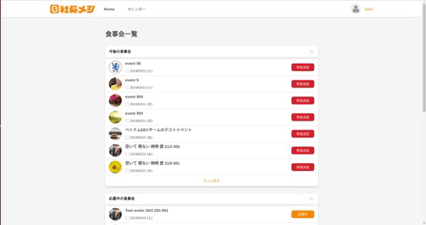

# JSX
```javascript
constructor(props) {
  super(props);
  this.state = {
    title1: '',
    title2: '',
    title3: ''
  };
  this.title1 = React.createRef();
  this.title2 = React.createRef();
  this.title3 = React.createRef();
}

componentDidMount() {
  window.addEventListener('scroll', () => {
    if (window.scrollY >= this.title1.offsetTop) {
      this.setState({ title1: 'multiple-sticky-titles title1' });
    } 
    if (window.scrollY < this.title1.offsetTop) {
      this.setState({ title1: '' });
    }
    if (window.scrollY >= this.title2.offsetTop - 48) {
      this.setState({ title2: 'multiple-sticky-titles title2' });
    } 
    if (window.scrollY < this.title2.offsetTop - 48) {
      this.setState({ title2: '' });
    }
    if (window.scrollY >= this.title3.offsetTop - 96) {
      this.setState({ title3: 'multiple-sticky-titles title3' });
    } 
    if (window.scrollY < this.title3.offsetTop - 96) {
      this.setState({ title3: '' });
    }
  });
}

render() {
  let titleGroupClass = '';
  if (this.props.title === '今後の食事会') {
    titleGroupClass = `event-group-title ${this.state.title1}`;
  }
  if (this.props.title === '募集中の食事会' || this.props.title === '応募中の食事会') {
    titleGroupClass = `event-group-title ${this.state.title2}`;
  }
  if (this.props.title === '過去の食事会') {
    titleGroupClass = `event-group-title ${this.state.title3}`;
  }

  return (
    <div className="event-list-small" ref={el => {
      if (this.props.title === '今後の食事会') {
        this.title1 = el;
      }
      if (this.props.title === '募集中の食事会' || this.props.title === '応募中の食事会') {
        this.title2 = el;
      }
      if (this.props.title === '過去の食事会') {
        this.title3 = el;
      }
    }}>
      <div className={titleGroupClass} />
    </div>
  )
}
```

# CSS
```css
.multiple-sticky-titles {
    max-width: 928px;
    width: 100%;
    position: fixed !important;
}
.title1 {
    top: 72px;
}
.title2 {
    top: 120px;
}
.title3 {
    top: 168px;
}
@media (max-width: 767px) {
    .multiple-sticky-titles {
        max-width: 355px;
    }
    .title1 {
        top: 48px;
    }
    .title2 {
        top: 96px;
    }
    .title3 {
        top: 144px;
    }
}
```

<p align="center">
  
</p>

<p align="center">
  
</p>
